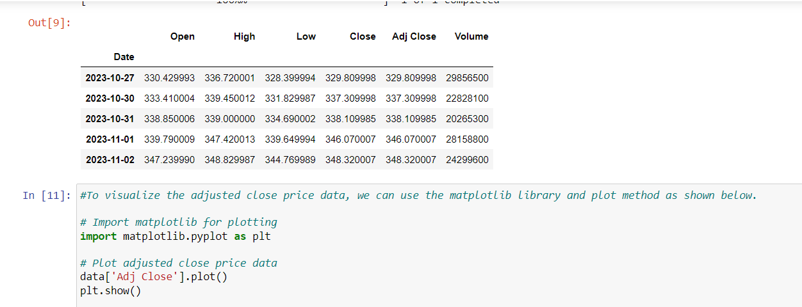

# Stock-Market-Analysis-Project

 This project Retrieves historical stock market data, create a plot of the stock's price history, and conduct a performance analysis of the stock.

## For this:

Install the **requirement.txt** file from the repo **** Then the python script as  [code.py](https://github.com/shashangka-upadhyaya/Stock-Market-Analysis-Project/blob/main/code.py)

### Results
**1. Get the historical stock value of Apple,IBM, Microsoft,Walmart

**2. in depth analysis is done from this data set using yahoo finace and new york stock exchange  [here](https://www.nyse.com/listings_directory/stock)**

**3. To visualize the adjusted close price data, we can use the matplotlib library and plot method as shown below 

